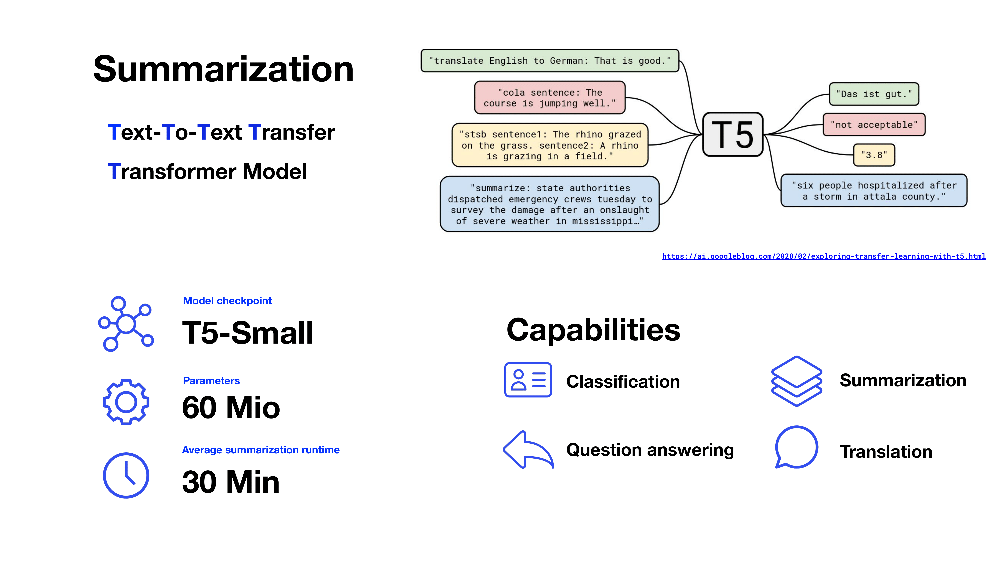
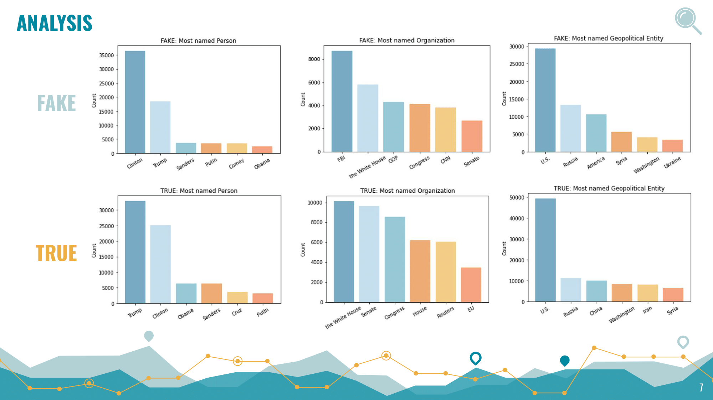
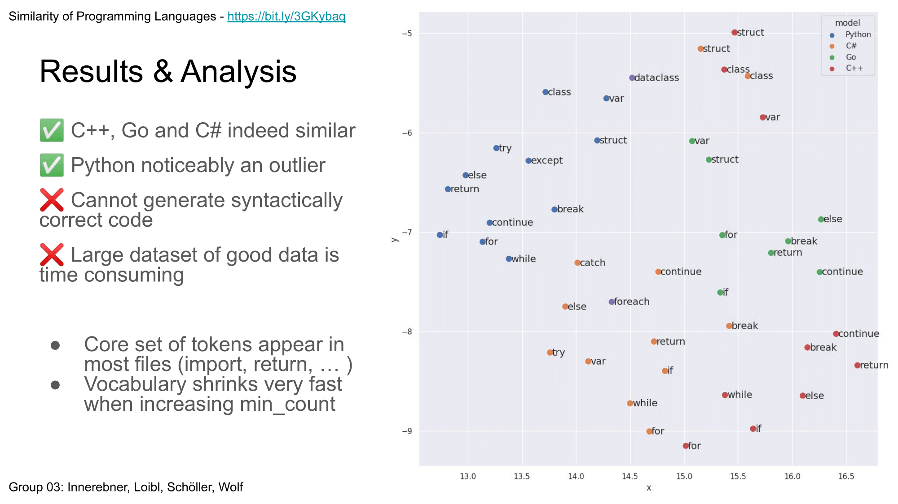
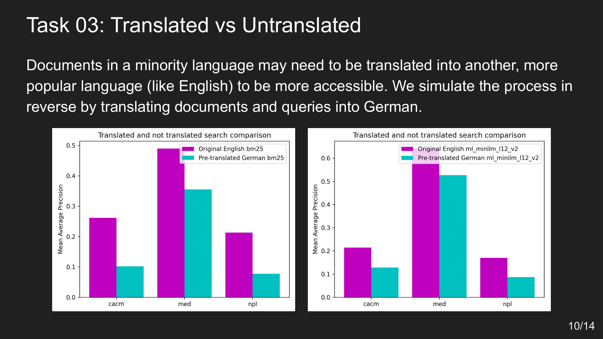

# Advanced IR WS22 Project Highlights

This pages features well conducted IR projects of Advanced Information Retrieval of winter term 2022 (in no particular order).  
Slides of their final presentation and their code-base are openly available.  

## Comparison of Re-rankers 
> Julian Rakuschek  
> Matthias Hülser  

[Slides](files/group30.pdf) and Repo: [https://github.com/Vulturemox/air-2022](https://github.com/Vulturemox/air-2022)  

## Marco Polo: Testing retrieval performance on summarized documents
> Fabian Staber  
> Matthias Paltauf  
> Martin Brantner  
> Thomas Mühlbacher  

[Slides](files/group25.pdf) and Repo: [https://github.com/muehlt/marco-polo](https://github.com/muehlt/marco-polo)

## FBI - FakeNews BERT Inspector
> Sebastian Weidinger  
> Laura Weißl  

[Slides](files/group33.pdf) and Repo: [https://github.com/LauraWeissl/TUG_AdvancedInformationRetrieval_WS22](https://github.com/LauraWeissl/TUG_AdvancedInformationRetrieval_WS22)

## Similarity of Programming Languages: C/C++, C#, Go and Python
> Kevin Innerebner  
> Philip Loibl  
> Manuell Schöller  
> Tobias Wolf  

[Slides](files/group03.pdf) and Repo: [https://github.com/kev-inn/programming-languages-w2v](https://github.com/kev-inn/programming-languages-w2v)  

## Advanced IR Experiments with Language Models, Summarization and Translation using SBERT, Elasticsearch and trec_eval
> David Mihola  
> Manuel Riedl  
> Massimiliano Viola    
> Nico Ohler  

[Slides](files/group05.pdf) and Repo: [https://github.com/massimilianoviola/advanced-information-retrieval](https://github.com/massimilianoviola/advanced-information-retrieval)

