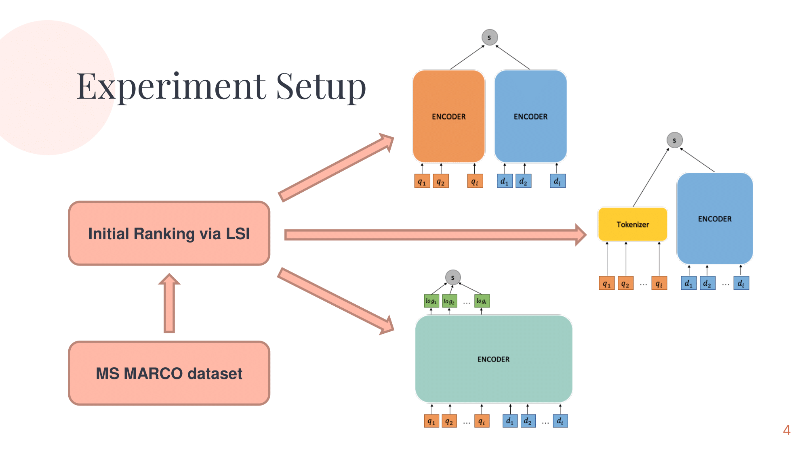

# Advanced IR WS22 Project Highlights

This pages features well conducted IR projects of Advanced Information Retrieval of winter term 2022 (in no particular order).

## Comparison of Re-rankers 
> Julian Rakuschek  
> Matthias Hülser  

Slides: [Slides30](files/group30.pdf)  
Repo: [https://github.com/Vulturemox/air-2022](https://github.com/Vulturemox/air-2022)  

## Marco Polo: Testing retrieval performance on summarized documents
> Fabian Staber  
> Matthias Paltauf  
> Martin Brantner  
> Thomas Mühlbacher  

Slides: [Slides25](files/group25.pdf)  
Repo: [https://github.com/muehlt/marco-polo](https://github.com/muehlt/marco-polo)

## FBI - FakeNews BERT Inspector
> Sebastian Weidinger  
> Laura Weißl  

Slides: [Slides33](files/group33.pdf)  
Repo: [https://github.com/LauraWeissl/TUG_AdvancedInformationRetrieval_WS22](https://github.com/LauraWeissl/TUG_AdvancedInformationRetrieval_WS22)

## Similarity of Programming Languages: C/C++, C#, Go and Python
> Kevin Innerebner  
> Philip Loibl  
> Manuell Schöller  
> Tobias Wolf  

Slides: [Slides03](files/group03.pdf)  
Repo: [https://github.com/kev-inn/programming-languages-w2v](https://github.com/kev-inn/programming-languages-w2v)  

## Advanced IR Experiments with Language Models, Summarization and Translation using SBERT, Elasticsearch and trec_eval
> David Mihola  
> Manuel Riedl  
> Massimiliano Viola    
> Nico Ohler  

Slides: [Slides05](files/group05.pdf)  
Repo: [https://github.com/massimilianoviola/advanced-information-retrieval](https://github.com/massimilianoviola/advanced-information-retrieval)

